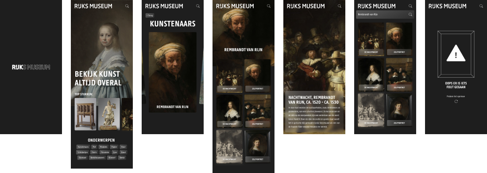

# Rijksmuseum Art Experience

De Rijksmuseum Art Experience is een webapp waar je allemaal verschillende soorten kunst kunt bekijken. Zo kun je op de homepage de top 10 kunstwerken bekijken. Verder kun je ook op onderwerp zoeken en zoeken naar een specifiek kunstwerk. Wanneer je op een kunstwerk klikt, kom je op een detailpagina waar je meer informatie over het kunstwerk kunt lezen.

_Alle projecten in deze map zijn gedurende de Minor Web Design & Development gemaakt voor het vak Web App From Scratch._

## Inhoud

- [Mijn GitHub Pages](#mijn-github-pages)
- [Mijn proces](#mijn-proces)
- [Hoe installeer je de Rijksmuseum Art Experience](#hoe-installeer-je-de-rijksmuseum-art-experience)
- [Hoe gebruik je de Rijksmuseum Art Experience](#hoe-gebruik-je-de-rijksmuseum-art-experience)
- [To Do](#to-do)
- [License](#license)

## Mijn GitHub Pages

1. [Visitekaartje](https://inevdhoven.github.io/web-app-from-scratch-2223/visitekaartje/)
2. [Squadpage](https://inevdhoven.github.io/web-app-from-scratch-2223/team/)
3. [Single Page App](https://inevdhoven.github.io/web-app-from-scratch-2223/spa/)

## Mijn proces

Mijn hele proces kun je [hier](https://smooth-freeze-4ae.notion.site/Web-App-From-Scratch-a8473f4f91ad45a18fd38bfde067b336) op Notion vinden.

## Hoe installeer je de Rijksmuseum Art Experience

## Hoe gebruik je de Rijksmuseum Art Experience

### Rijksmuseum API: RijksData

Voor deze webapp heb ik gebruik gemaakt van de Rijksmuseum API. Deze API bevat alle informatie over de kunstwerken die in het Rijksmuseum hangen. De API bevat informatie over de kunstwerken en de kunstenaars.

### Hoe werkt de Rijksmuseum API: RijksData

De Rijksdata api is een RESTful API. Dit betekent dat de API data teruggeeft in JSON formaat. Je kunt op veel verschillende manier data opvragen. Je kunt bijvoorbeeld een specifiek kunstwerk ophalen of kunstwerken uit een specifiek onderwerp.

Je kan de data ophalen doormiddel van een `FETCH`, deze kun je terugvinden in het bestand `data.js` in het mapje `spa/js/modules`.

Om meer te weten over de Rijks Data API kun je [hier](https://data.rijksmuseum.nl/object-metadata/api/) meer lezen.

## To Do:

In de issues kun je de punten vinden waar ik nog naar moet kijken. [Klik hier](https://github.com/Inevdhoven/web-app-from-scratch-2223/issues) om naar issues te gaan.

## License

Deze Single Page App maakt gebruik van een MIT License. Je kunt meer lezen over de MIT License [hier](https://github.com/Inevdhoven/web-app-from-scratch-2223/blob/main/LICENSE).

## Credits

Ik wil graag de volgende mensen bedanken voor hun hulp:

- De docenten van het vak Web App From Scratch
- Mijn medestudenten

<!-- replace the code in the /docs folder with your own, so you can showcase your work with GitHub Pages 🌍 -->

<!-- How about a section that describes how to install this project? 🤓 -->

<!-- ...but how does one use this project? What are its features 🤔 -->

<!-- What external data source is featured in your project and what are its properties 🌠 -->

<!-- Maybe a checklist of done stuff and stuff still on your wishlist? ✅ -->

<!-- How about a license here? 📜 (or is it a licence?) 🤷 -->
