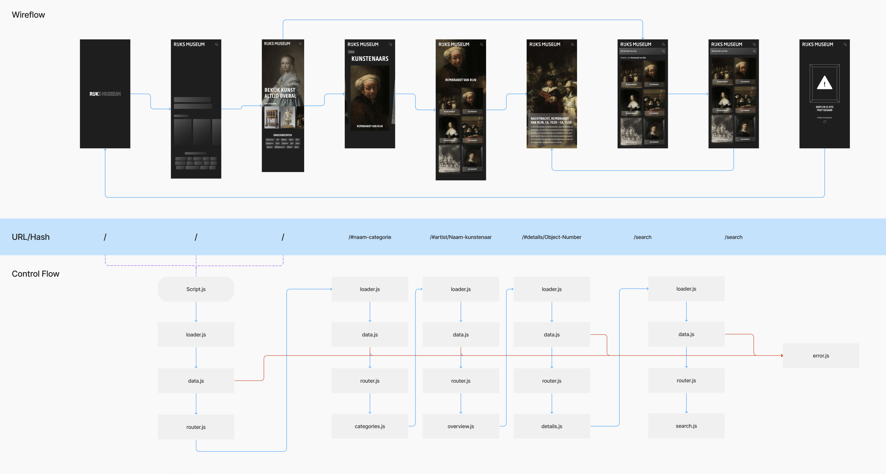

# Rijksmuseum Art Experience

De Rijksmuseum Art Experience is een webapp waar je allemaal verschillende soorten kunst kunt bekijken. Zo kun je op de homepage de top 10 kunstwerken bekijken. Verder kun je ook op onderwerp zoeken en zoeken naar een specifiek kunstwerk. Wanneer je op een kunstwerk klikt, kom je op een detailpagina waar je meer informatie over het kunstwerk kunt lezen.

_Alle projecten in deze map zijn gedurende de Minor Web Design & Development gemaakt voor het vak Web App From Scratch._

_De app wijkt iets af van het design hierboven, omdat ik voor bepaalde onderdelen niet genoeg tijd had of niet helemaal mogelijk waren._

Deze webapp is gemaakt voor mobiel.

## Inhoud

- [Mijn GitHub Pages](#mijn-github-pages)
- [Mijn proces](#mijn-proces)
- [Activity Diagram](#activity-diagram)
- [Hoe gebruik je de Rijksmuseum Art Experience?](#hoe-gebruik-je-de-rijksmuseum-art-experience)
- [Hoe installeer je de Rijksmuseum Art Experience?](#hoe-installeer-je-de-rijksmuseum-art-experience)
- [To Do](#to-do)
- [License](#license)
- [Credits](#credits)

## Mijn GitHub Pages

1. [Visitekaartje](https://inevdhoven.github.io/Rijksmuseum-Art-Experience-App/visitekaartje/)
2. [Squadpage](https://inevdhoven.github.io/Rijksmuseum-Art-Experience-App/team/)
3. [Single Page App](https://inevdhoven.github.io/Rijksmuseum-Art-Experience-App/spa/)

## Mijn proces

Mijn hele proces kun je [hier](https://smooth-freeze-4ae.notion.site/Web-App-From-Scratch-a8473f4f91ad45a18fd38bfde067b336) op Notion vinden.

## Activity Diagram

## Hoe gebruik je de Rijksmuseum Art Experience?

De Rijksmuseum Art Experience is een webapp gemaakt voor mobiel, zodat je overal van kunst genieten. Je kunt de app gebruiken door naar de [GitHub Pages](https://inevdhoven.github.io/Rijksmuseum-Art-Experience-App/spa/) te gaan.

Wanneer je de webapp opent kom je op de homepage. Hier kun je de top 10 kunstwerken bekijken, deze verander om de paar dagen. Hierdoor blijft het leuk om ernaar te kijken. Je kunt ook op onderwerp zoeken, zoals schilderijen, potten of meubels. Daarnaast kun je ook naar een specifiek kunstwerk zoeken, door bovenin op het zoek icoontje te klikken. Wanneer je op een kunstwerk klikt, kom je op een detailpagina waar je meer informatie over het kunstwerk kunt lezen.

## Hoe installeer je de Rijksmuseum Art Experience?

Wanneer je de Rijksmuseum Art Experience lokaal wilt laten draaien, kun je de volgende stappen volgen:

1. Open de terminal en ga op zoek naar de map waar je de webapp wilt opslaan.
2. Clone de repository door het volgende in de terminal in te vullen:

   `git clone https://github.com/Inevdhoven/Rijksmuseum-Art-Experience-App.git`

3. Ga naar de map `spa` en open de `index.html` in de browser.
4. Nu kun je de app gebruiken en aanpassen naar eigen wens.

## Rijksmuseum API: Rijks Data

Voor deze webapp heb ik gebruik gemaakt van de Rijksmuseum API. Deze API bevat alle informatie over de kunstwerken die in het Rijksmuseum hangen. De API bevat informatie over de kunstwerken en de kunstenaars.

### Hoe werkt de Rijksmuseum API: Rijks Data

De Rijks Data API is een RESTful API. Wat in dit geval betekent dat de API data teruggeeft in de taal JSON. Je kunt op veel verschillende manier data opvragen. Je kunt bijvoorbeeld een specifiek kunstwerk of kunstwerken uit een specifiek onderwerp ophalen.

Om de Rijks Data API te kunnen gebruiken moet je wel eerst een Rijksstudio account aanmaken, zodat je een key kunt aanvragen. Deze key heb je nodig om de API te kunnen gebruiken. Je kunt [hier](https://www.rijksmuseum.nl/nl/registreer) een account aanmaken.

Je kan de data ophalen doormiddel van een `FETCH`, deze kun je terugvinden in het bestand `data.js` in het mapje `spa/js/modules`.

Om meer te weten over de Rijks Data API kun je [hier](https://data.rijksmuseum.nl/object-metadata/api/) meer lezen.

## To Do:

In de issues kun je de punten vinden waar ik nog naar moet kijken. [Klik hier](https://github.com/Inevdhoven/web-app-from-scratch-2223/issues) om naar issues te gaan.

| To Do                                                    | Status             |
| -------------------------------------------------------- | ------------------ |
| Homepage                                                 | :white_check_mark: |
| Top stukken ophalen                                      | :white_check_mark: |
| Op onderwerp zoeken                                      | :white_check_mark: |
| Onderwerp in slider inladen                              | :white_check_mark: |
| Zoek functie                                             | :white_check_mark: |
| Detailpagina                                             | :white_check_mark: |
| UI-Stack toevoegen                                       | :white_check_mark: |
| Readme schrijven                                         | :white_check_mark: |
| Hashing/routie toevoegen                                 | :white_check_mark: |
| Code in modules zetten                                   | :white_check_mark: |
| Optie om gehele image te bekijken toevoegen              | :white_check_mark: |
| Niet gebruikte documenten verwijderen                    | :white_check_mark: |
| Contrast verbeteren detailspagina                        | :white_check_mark: |
| Placeholder image aanpassen                              | :white_check_mark: |
| dvh inplaats van vh gebruiken                            | :white_check_mark: |
| Loading state toevoegen aan zoeken                       | :white_check_mark: |
| Zoeken met klik op enter                                 | :white_check_mark: |
| Zero state toevoegen                                     | :white_check_mark: |
| Filter() en Reduce() toevoegen                           |                    |
| Zoek icoontje in header aanpassen wanneer aan het zoeken |                    |
| Progressive disclosure toepassen bij de detailpagina     |                    |
| Afbeeldingen kleiner maken                               |                    |
| Gerelateerde kunstwerken toevoegen aan detailpagina      |                    |

## License

Deze Single Page App maakt gebruik van een MIT License. Je kunt meer lezen over de MIT License [hier](https://github.com/Inevdhoven/Rijksmuseum-Art-Experience-App/blob/main/LICENSE).

## Credits

Ik wil graag de volgende mensen bedanken voor hun hulp:

- De docenten van het vak Web App From Scratch
- Mijn medestudenten
